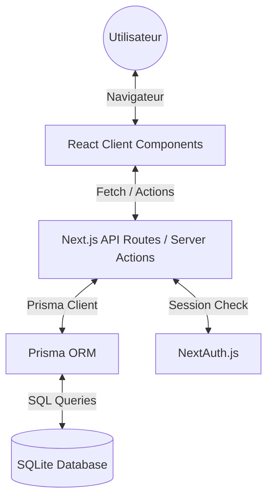

# 🎮 BDJ - Architecture & Guide Technique

Ce document détaille le fonctionnement interne de la plateforme du Bureau des Jeux (CPE Lyon). Il s'adresse aux développeurs souhaitant comprendre l'interaction entre les différentes couches de l'application.

---

## 🏛️ Architecture Globale (High-Level)

L'application utilise **Next.js 15** avec le **App Router**. Contrairement aux architectures traditionnelles, les frontières entre le serveur et le client sont gérées au niveau des composants.



---

## 🖥️ Le Côté Serveur (The Backbone)

Le serveur gère la persistance des données, l'authentification et le rendu initial.

### 1. Server Components (`src/app/`)
Par défaut, tous les fichiers dans `src/app/` sont des **Server Components**.
- **Avantage** : Ils peuvent importer `prisma` directement sans exposer les secrets au client.
- **Fonctionnement** : Le composant s'exécute côté serveur, récupère les données (`await prisma.user.findMany()`), et génère le HTML final envoyé au navigateur.
- **Exemple** : La page `profil/page.tsx` récupère la session et les réservations en une seule passe serveur avant même que l'utilisateur ne voie la page.

### 2. API Routes (`src/app/api/`)
Utilisées pour les opérations de modification (POST/DELETE) ou les services tiers.
- **`getServerSession(authOptions)`** : La fonction clé pour vérifier l'identité de l'appelant côté serveur.
- **Techno** : Routes handlers standard de Next.js (`export async function POST(req) { ... }`).
- **Cas d'usage** : `/api/member/verify` pour invalider un QR code après scan.

---

## 🖌️ Le Côté Client (Interactivité)

Défini par la directive `'use client'`, le côté client gère l'état de l'interface et les interactions riches.

### 1. État et Hooks
- **`useState` & `useEffect`** : Utilisés pour la gestion locale (ex: ouvrir un modal, afficher un minuteur).
- **`useSession()`** : Hook de NextAuth pour accéder aux infos de l'utilisateur connecté sans recharger la page.

### 2. Communication Client -> Serveur
L'interaction se fait via des appels `fetch()` standard vers les API routes :
```javascript
// Exemple type dans un composant client
const handleAction = async () => {
  const res = await fetch('/api/local/book', { 
    method: 'POST', 
    body: JSON.stringify(data) 
  });
  if (res.ok) router.refresh(); // Force Next.js à re-fetch les Server Components
};
```

---

## 🗄️ Base de Données & Modèle de Données

### 1. Prisma ORM : Le Pont
Prisma transforme votre schéma de base de données en un client TypeScript auto-généré.
- **Modèle de données** (`prisma/schema.prisma`) : La source unique de vérité.
- **Prisma Client** (`src/lib/prisma.ts`) : Instance unique partagée pour éviter l'épuisement des connexions SQLite.

### 2. Modèles Principaux & Relations
- **`User`** : Le cœur du système. Relié à `Booking` (1:N) et `Player` (1:1 optionnel).
- **`Booking`** : Gère les créneaux du local. Lié à un `User` via `userId`.
- **`EsportTeam` & `Player`** : Structure en cascade. Une équipe possède plusieurs joueurs, qui peuvent être liés (ou non) à un compte `User` (pour les stats).

### 3. SQLite : Persistance Légère
Les données sont stockées dans `prisma/dev.db`. C'est un moteur relationnel complet, supportant les transactions (essentiel pour éviter les doubles réservations sur le même créneau).

---

## 🔐 Sécurité & Authentification

### 1. Authentification Hybride (NextAuth)
Le système d'authentification est le pivot de la sécurité :
- **Provider** : `CredentialsProvider` gère la connexion via e-mail (CPE) et mot de passe (haché avec `bcryptjs`).
- **Callback `authorize`** : Lors de la connexion, le serveur vérifie les identifiants, mais aussi si l'e-mail a été vérifié (`emailVerified`).
- **Callbacks `jwt` & `session`** : Ces fonctions (dans `src/lib/auth.ts`) permettent de faire transiter des données personnalisées (comme `isMember` ou `id`) depuis la DB vers le token chiffré, puis vers la session accessible côté client.
- **Stratégie** : JWT (JSON Web Token) chiffré stocké dans un cookie `httpOnly` (invisible pour le JS client, prévenant les attaques XSS).
- **Validation** : Les routes sensibles vérifient `isMember` ou les emails d'admins stockés dans la variable d'environnement `ADMIN_EMAILS`.

---

## 🛠️ Exemples d'Interactions Techniques

### Scénario : Génération du QR Code Membre
1.  **Serveur** (`profil/page.tsx`) : Détecte si `user.isMember` est vrai.
2.  **Client** (`MemberCard.tsx`) : Appelle `/api/member/qr`.
3.  **API** (`/api/member/qr/route.ts`) :
    - Vérifie la session.
    - Génère un `qrToken` aléatoire via `crypto.randomBytes(32)`.
    - Enregistre le token dans la DB via `prisma.user.update`.
4.  **Client** : Reçoit le token et utilise `QRCodeSVG` pour le dessiner localement.

### Scénario : Admin Dashboard (Migration)
Le dashboard admin est passé de `le-local/` au `profil/`.
- **Logique** : Le serveur filtre les `bookings` seulement si l'email de session est dans la liste des admins.
- **Modèle** : Utilisation de `include: { user: true }` dans la requête Prisma pour récupérer les noms des étudiants en une seule jointure SQL performante.

---

## 📂 Structure du Projet (Tree View)

```bash
BDJ
├── prisma/                 # Configuration BDD & Migrations
│   ├── dev.db              # SQLite Database
│   └── schema.prisma       # Modèles de données (Source of truth)
├── public/                 # Assets statiques (Photos, Icons)
├── src/
│   ├── app/                # Next.js App Router (Pages & API)
│   │   ├── api/            # Route Handlers (Back-end)
│   │   ├── le-local/       # Module de réservation
│   │   ├── profil/         # Espace utilisateur & Admin Dashboard
│   │   ├── layout.tsx      # Structure globale (Header/Footer)
│   │   └── page.tsx        # Landing Page
│   ├── components/         # Composants UI réutilisables (React)
│   │   ├── MemberCard.tsx  # Carte de fidélité dynamique
│   │   ├── Header.tsx      # Barre de navigation
│   │   └── ...
│   ├── lib/                # Configs & instances partagées
│   │   ├── auth.ts         # Logique NextAuth
│   │   └── prisma.ts       # Singleton Prisma Client
│   └── data/               # Données statiques ou mockées
├── package.json            # Dépendances & scripts
├── tsconfig.json           # Config TypeScript
└── next.config.ts          # Config Next.js
```
