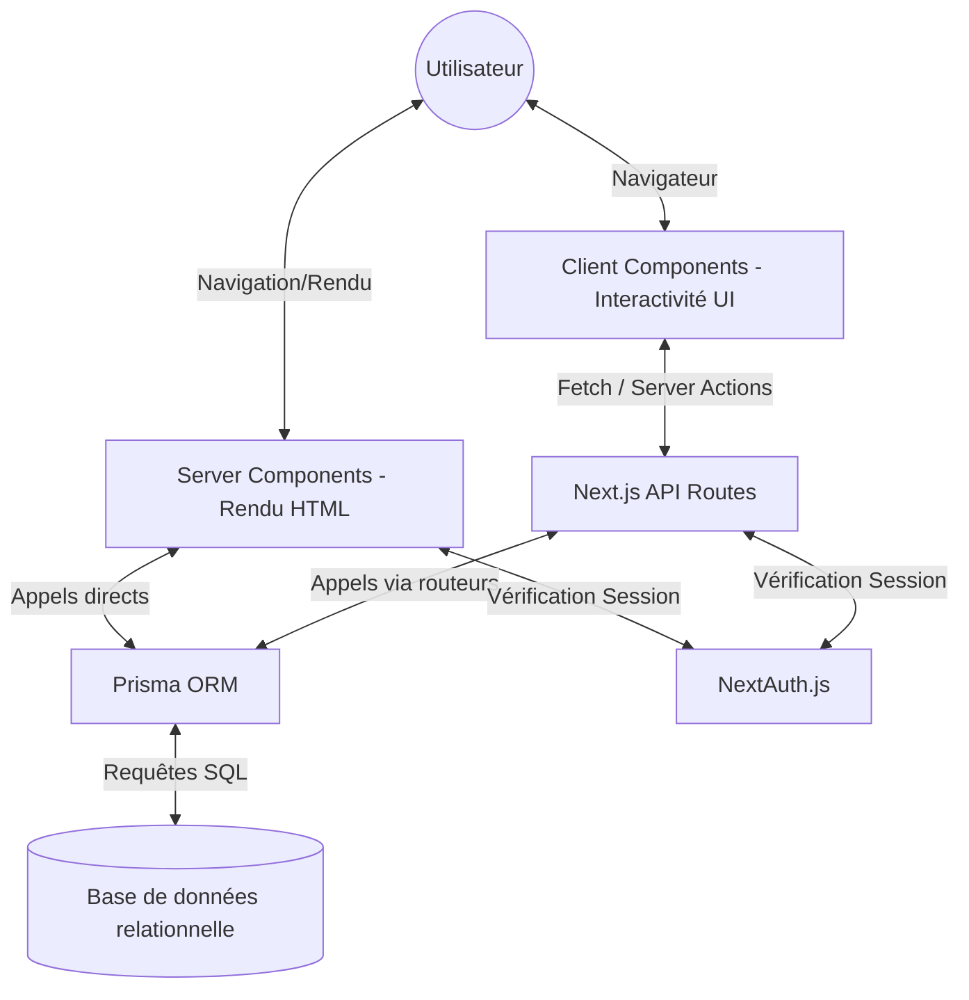

# 🎮 Bureau des Jeux (BDJ) - Architecture & Guide Technique

Ce document détaille le fonctionnement interne de la plateforme du Bureau des Jeux (CPE Lyon). Il s'adresse aux développeurs, aux contributeurs actuels, ainsi qu'aux futurs responsables techniques de l'association souhaitant comprendre, maintenir et faire évoluer l'application.

---

## 📋 Sommaire

- [🏛️ Architecture Globale](#️-architecture-globale)
- [🏗️ Philosophie de Développement](#️-philosophie-de-développement)
- [🗄️ Modèle de Données & ORM (Prisma)](#️-modèle-de-données--orm-prisma)
- [🔐 Sécurité & Authentification (NextAuth)](#-sécurité--authentification-nextauth)
- [📂 Structure du Projet](#-structure-du-projet)
- [🚀 Déploiement & Intégration Continue](#-déploiement--intégration-continue)
- [🤝 Guide de Passation (Onboarding)](#-guide-de-passation-onboarding)

---

## 🏛️ Architecture Globale

L'application est construite avec **Next.js 15 (App Router)**, adoptant une approche moderne où les frontières entre le client et le serveur sont définies au niveau des composants. L'objectif principal est la séparation des préoccupations (**Clean Architecture**) et la maintenabilité à long terme.



---

## 🏗️ Philosophie de Développement (Clean Code)

Pour garantir la pérennité du projet, nous appliquons des principes de développement stricts :

### 1. Approche Orientée Composant
- **Encapsulation** : Chaque composant est responsable de son propre rendu et de sa propre logique d'affichage. Les données métier complexes sont gérées plus haut dans l'arborescence.
- **CSS Modules** : Les styles sont isolés (ex: `Hero.module.css`) pour éviter les conflits globaux. La composition CSS est privilégiée pour les variations.
- **"Dumb Components"** : Les composants UI purs reçoivent leurs données via des props et ignorent l'origine de ces données, ce qui les rend hautement réutilisables.

### 2. Le Côté Serveur (The Backbone)
Le serveur gère la persistance, l'authentification et le rendu initial pour la performance et le SEO.
- **Server Components** (`src/app/`) : Par défaut, les composants sont exécutés côté serveur. Ils peuvent interagir directement avec Prisma sans exposer de logique sensible au client.
- **API Routes** (`src/app/api/`) : Utilisées pour les opérations asynchrones (POST/DELETE) ou pour interagir avec des services tiers (ex: Webhooks HelloAsso).

### 3. Le Côté Client (Interactivité)
Défini explicitement par la directive `'use client'` en haut de fichier.
- **Usage Restreint** : Limité aux composants nécessitant une interactivité immédiate (modales, compteurs, gestion d'état local).
- **Communication** : L'interaction avec la base de données se fait via des appels `fetch()` vers nos API Routes ou via les **Server Actions**.

---

## 🗄️ Modèle de Données & ORM (Prisma)

Prisma est notre pont (**Object-Relational Mapping**) vers la base de données. Il garantit un typage fort (**TypeScript**) de bout en bout.

- **Source de Vérité** : Le fichier `prisma/schema.prisma` définit la structure complète de l'application.
- **Client Unique** : L'instance Prisma est centralisée dans `src/lib/prisma.ts` pour gérer efficacement le pool de connexions.

### Entités Principales
- **User** : Le cœur du système (authentification NextAuth).
- **Booking** : Gestion des créneaux du local, lié à un User.
- **Event / Reservation** (En cours) : Modèles prévus pour la synchronisation avec HelloAsso.

---

## 🔐 Sécurité & Authentification (NextAuth)

Le système repose sur **NextAuth.js** pour une authentification sécurisée et sans friction :

- **Stratégie JWT** : Les sessions sont gérées via des tokens chiffrés stockés dans des cookies `httpOnly`, protégeant l'application contre les failles XSS.
- **Callbacks** (`src/lib/auth.ts`) : Nous enrichissons le token avec des données métier (ex: le rôle `isAdmin` ou le statut `isMember`).
- **Protection des Routes** : Les composants serveurs et les API routes critiques vérifient systématiquement la validité de la session via `getServerSession()`.

---

## 📂 Structure du Projet

```bash
BDJ
├── prisma/                 # Configuration BDD & Migrations
│   ├── schema.prisma       # Modèles de données (Source of truth)
│   └── dev.db              # [LOCAL ONLY] SQLite Database
├── public/                 # Assets statiques (Images, Icônes)
├── src/
│   ├── app/                # Next.js App Router (Pages & API)
│   │   ├── (Home)/         # Fichiers de la Landing Page (Isolés)
│   │   ├── api/            # Route Handlers (Endpoints Back-end)
│   │   ├── poles/          # Pages détaillées des activités
│   │   ├── layout.tsx      # Structure globale (Header/Footer)
│   │   └── global.css      # Styles transversaux & Variables CSS
│   ├── components/         # Composants UI isolés et réutilisables
│   │   ├── Hero/           # Composant avec son .tsx et .module.css
│   │   ├── BentoGrid/      # Grille asymétrique
│   │   └── ...
│   ├── lib/                # Configs, utilitaires et instances partagées
│   │   ├── auth.ts         # Logique métier NextAuth
│   │   └── prisma.ts       # Singleton Prisma Client
│   └── data/               # Source of truth des données statiques
├── package.json            # Dépendances & scripts NPM
├── tsconfig.json           # Configuration TypeScript stricte
└── next.config.ts          # Configuration Next.js
```

---

## 🚀 Déploiement & Intégration Continue

### 1. Le Dépôt Central (GitHub)
Le code source est hébergé sur le repository GitHub de l'association.
- **Branche `main`** : C'est la branche de production. Tout code fusionné ici doit être stable et testé.
- **Workflow** : Le développement de nouvelles fonctionnalités (ex: Intégration HelloAsso) doit se faire sur des branches dédiées (`feature/helloasso`), validées par des **Pull Requests (PR)** avant fusion.

### 2. L'Hébergement (Vercel)
L'application est déployée sur **Vercel**, la plateforme native pour Next.js.
- **Déploiement Automatique (CI/CD)** : Chaque push sur la branche `main` déclenche un nouveau déploiement en production.
- **Preview Deployments** : Chaque Pull Request génère une URL temporaire pour tester les modifications.
- **Variables d'Environnement** : Les clés API sont stockées de manière sécurisée dans le tableau de bord Vercel. **Elles ne doivent jamais être commitées sur GitHub.**

---

## 🤝 Guide de Passation (Onboarding)

Ce guide est destiné au repreneur du projet (nouveau Tech Lead ou développeur du BDJ).

### Prérequis Techniques
- Avoir installé **Node.js** (LTS recommandé) et **Git**.
- Disposer d'un éditeur de code (**VS Code** recommandé) avec les extensions : **ESLint**, **Prettier**, et **Prisma**.

### Étape 1 : Récupérer le projet
Clonez le dépôt officiel sur votre machine :
```bash
git clone https://github.com/votre-organisation/bdj-website.git
cd bdj-website
```

### Étape 2 : Installer les dépendances
```bash
npm install
```
*(Note : En cas de conflits, utilisez `npm install --legacy-peer-deps`)*.

### Étape 3 : Configuration locale
1. Demandez au précédent Tech Lead les valeurs du fichier de configuration local.
2. Créez un fichier `.env` à la racine (ignoré par Git).
3. Collez-y les variables nécessaires (`DATABASE_URL`, `NEXTAUTH_SECRET`, etc.).

### Étape 4 : Initialiser la Base de Données
```bash
npx prisma generate
```
Si vous utilisez une base locale (SQLite) non initialisée :
```bash
npx prisma db push
```

### Étape 5 : Lancer le moteur
```bash
npm run dev
```
L'application est maintenant accessible sur [http://localhost:3000](http://localhost:3000).

---

## ⚠️ Avertissements pour le successeur

- **Dette Technique** : Priorisez toujours la correction des bugs d'interface mobile. 80% des étudiants visitent le site depuis leur téléphone.
- **OneDrive/CloudSync** : Ne placez jamais le projet dans un dossier synchronisé (comme OneDrive). La synchronisation de `node_modules` ralentira votre machine.
- **Base de Données en Production** : Attention aux migrations Prisma. Testez toujours localement avant de déployer.